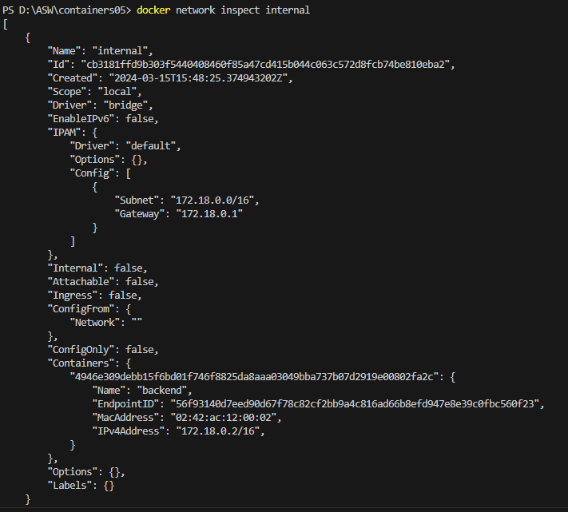

# Лабораторная работа: Взаимодействие контейнеров

## Цель работы
Освоить управление взаимодействием нескольких контейнеров с использованием Docker.

## Задание
Создать php приложение на базе двух контейнеров: nginx, php-fpm.

## Описание выполнения работы 
1. В директории containers05 создайем директорию mounts/site. В данную директорию добавляем сайт на php, созданный в рамках предмета по php.
2. Создайем файл .gitignore в корне проекта, чтобы игнорировать файлы и директории в mounts/site.
3. В директории containers05 создаем файл nginx/default.conf.
4. Создаем сеть internal для контейнеров.
 
5. Создаем контейнер backend со следующими свойствами:
-на базе образа php:7.4-fpm;
-к контейнеру примонтирована директория mounts/site в /var/www/html;
-работает в сети internal.

6. Создаем контейнер frontend со следующими свойствами:
-на базе образа nginx:1.23-alpine;
-с примонтированной директорией mounts/site в /var/www/html;
-с примонтированным файлом nginx/default.conf в /etc/nginx/conf.d/default.conf;
-порт 80 контейнера проброшен на порт 80 хоста;
-работает в сети internal.

7. Проверяем работу сайта в браузере, перейдя по адресу http://localhost. 

## Выводы
Проект успешно реализован, и PHP-приложение запущено в двух контейнерах - nginx и php-fpm. Это позволяет разделить слои веб-сервера и интерпретатора PHP для лучшей масштабируемости и управляемости.

## Ответы на вопросы
1. Каким образом в данном примере контейнеры могут взаимодействовать друг с другом? Контейнеры могут взаимодействовать друг с другом через сеть internal, которая была создана специально для этой цели. Они могут обращаться друг к другу по именам backend и frontend, используя их как хосты внутри сети.
2. Как видят контейнеры друг друга в рамках сети internal? Контейнеры могут видеть друг друга по именам хостов, которые они были заданы в момент запуска. Например, контейнер frontend может обращаться к контейнеру backend по имени backend
3. Почему необходимо было переопределять конфигурацию nginx? Конфигурация nginx была переопределена, чтобы настроить его для обработки PHP-скриптов через php-fpm. Это необходимо для того, чтобы nginx мог правильно передавать запросы на исполнение PHP-скриптов контейнеру backend, где работает php-fpm.
